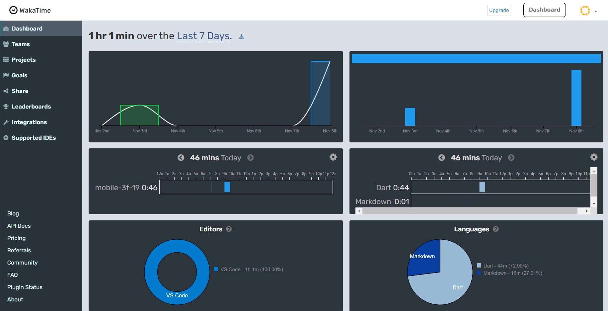

di flutter semua berbasis widget. scaffold untuk menampilkan wadah dasar aplikasi flutter. tittle meminta widget jadi tidak bisa langsung string. style menggunakan TextStyle. apabila alergi garis bawah seperti biru-biru maka menggunakan const. label text untuk menulis judul diatas berwarna biru kecil. keyboardtype digunakan input login email atau username tergantung syntax yang digunakan. Button banyak jenisnya diflutter dapat dilihat di guide flutter at google. Otomatis dibuatkan onPressed dan child. onProssed ditulis null agar button diklik tidak menghasilkan apa-apa, button disable karena onPressed bernilai null. kalau function yang dieksekusi hanya satu maka menggunakan tanda panah, jika function lebih dari satu maka menggunakan kurawal. 

Card digunakan untuk supaya ada lengkungannya. Margin harus menggunakan EdgeInserts, kalau pakai yang all, semua kalau pake yang fromLTRB maka kanan kiri atas bawah diatur ukurannya masing masing, kalau only untuk mengatur beberapa bagian yang ingin diatur.

Elevation digunakan untuk menambah shadow. Container di wrap dengan column agar semua desain menjadi center dan tampilan tidak terlalu panjang. Jika ingin mengubah posisi column maka akan menggunakan mainAxisAlignment.

Routes untuk pathing seperti di laravel. InkWell memiliki fungsi seperti href di pemrograman web.

